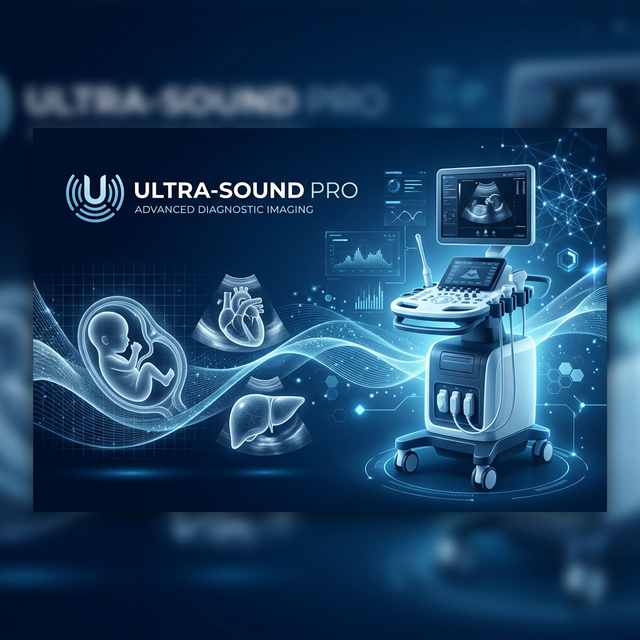

# Ultrasound-Pro



## 🩺 Advanced US-Guided Procedural Manual

Ultrasound-Pro is a high-fidelity, interactive procedural guide designed for sports medicine residents and physicians. It provides rapid, point-of-care access to ultrasound-guided injection techniques with expert clinical pearls and supply checklists.

### 🌐 [Live Web App](https://Zshumake.github.io/Ultrasound-Pro/)

---

## 🚀 Key Features

### 💎 Futuristic Medical UI
*   **Immersive Dashboard**: High-density grid for rapid browsing.
*   **Adaptive Sidebar**: Organized by anatomical region (Shoulder, Hip, Hand, Foot, etc.).
*   **Deep Midnight Mode**: Optimized for high-contrast visibility in darkened ultrasound suites.

### 📋 Clinical Utility
*   **Prepare Your Tray**: Every injection includes a "Clinical Kit" checklist (Needles, Syringes, Meds).
*   **Expert Pearls**: Institutional wisdom from Dr. Finoff and Dr. Call integrated into every procedure.
*   **My Favorites**: Quick-access bookmarking for your most frequent procedures.

### 🔍 Precision Data
*   **Guided Mapping**: Visual placement guides for Probe, Patient Position, and Skin Landmarks.
*   **Correct Image Criteria**: Clear anatomical objectives for Every target view.
*   **Institutional Alignment**: Fully audited content aligned with specialized sports medicine curricula.

---

## 🛠 Tech Stack

*   **Core**: Flutter (Stable)
*   **Platform**: Web, macOS, iOS, Android
*   **State Management**: Foundation ChangeNotifier
*   **Styling**: Medical Midnight Design System (Vanilla CSS/Flutter)

---

## 🧑‍💻 Getting Started

### Prerequisites
*   [Flutter SDK](https://flutter.dev/docs/get-started/install)
*   Git

### Installation
1.  Clone the repository:
    ```bash
    git clone https://github.com/Zshumake/Ultrasound-Pro.git
    ```
2.  Install dependencies:
    ```bash
    flutter pub get
    ```
3.  Run the application:
    ```bash
    flutter run -d chrome  # Web
    # OR
    flutter run -d macos   # Desktop
    ```

---

## 🧪 Deployment

This project uses **GitHub Actions** for CI/CD. Any push to the `main` branch automatically builds and deploys the latest version to [GitHub Pages](https://Zshumake.github.io/Ultrasound-Pro/).

---

## 📜 License

Created for Residents & Medical Education. All clinical content should be verified by a licensed professional.
